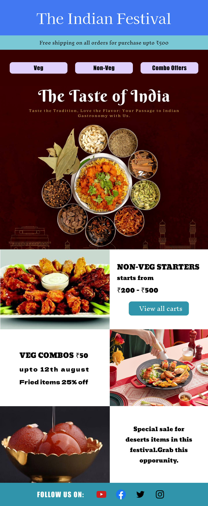

Here's a README template for your three tasks, with placeholders for screenshots:

---

# CodSoft Internship Tasks

This repository contains the completed tasks for my CodSoft UI/UX design internship. Below is a brief overview of each task, along with screenshots to illustrate the work done.

## Task 1: Mobile Application Signup Flow

### Overview
In Task 1, I designed a seamless signup flow for a mobile application. The goal was to create a user-friendly process that ensures a smooth onboarding experience.

### Screens
- **Screen 1: Entry Screen**  
  This is the initial screen that welcomes users and provides options to sign up or sign in.

- **Screen 2: Signup Screen**  
  A straightforward form that collects essential user information for account creation.

- **Screen 3: Signin Screen**  
  A simple login interface with options like "Forgot Password" and "Remember Me."

- **Screen 4: Home Screen**  
  The main screen users see after signing up or signing in, providing access to the app's features.

### Screenshot

---

## Task 2: Food Festival Newsletter Email Template

### Overview
Task 2 involved creating a visually appealing email template for a food festival newsletter. The design is focused on capturing the festive spirit and encouraging attendance.

### Key Features
- **Vibrant Design**: Uses bold colors and appetizing images to grab attention.
- **Event Highlights**: Showcases key attractions, such as special menus and live cooking demonstrations.
- **Responsive Layout**: Ensures the template looks great on all devices.

### Screenshot

---

## Task 3: Restaurant Menu Website

### Overview
For Task 3, I designed a restaurant menu website with a focus on ease of use and aesthetics. The site allows users to explore various dishes, make selections, and complete their orders.

### Screens
- **Screen 1: Home Screen**  
  Displays recommended dishes, cuisines, and a search bar for easy navigation.

- **Screen 2: Explore Screen**  
  Offers a variety of foods with filtering options to help users find exactly what they want.

- **Screen 3: Food Screen**  
  Provides detailed descriptions of selected dishes.

- **Screen 4: Add to Cart Screen**  
  Shows the selected items, total bill, and allows users to add extra items before proceeding to checkout.

### Screenshot

---

## How to View

To view these tasks :

Click the Link Below to view the task

[Task 1](https://www.figma.com/design/sLNkGQcM44ooaG2uWFldFj/Sign-up-Flow?node-id=0-1&t=hd7AEP1Fzx5TimMb-0)
[Task 2](https://www.figma.com/design/RsmXQzXIGiFVhc0o49Ml5f/newsletter?node-id=0-1&t=ZN6kWvdAf2HWbNH8-0)
[Task 3](https://www.figma.com/design/3xjHscdHnQ67CnL0xcVMc7/Resturant-Menu?node-id=9-2&t=S6xH8V935fYfgKsQ-0)
